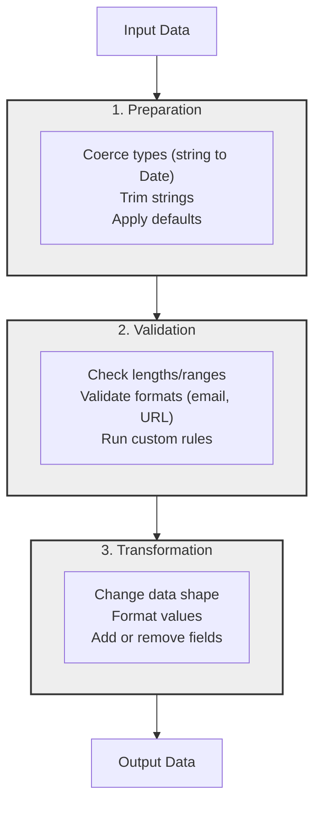

[](https://www.npmjs.com/package/s-validator)
[](https://opensource.org/licenses/MIT)
[](http://www.typescriptlang.org/)
[](https://github.com/ntropish/s-validator/blob/main/package.json)

# s-validator

**A simple, lightweight, and type-safe validation library for TypeScript and JavaScript.**

`s-validator` provides a straightforward and declarative API for building validation schemas, ensuring your data conforms to the required structure and types without any external dependencies.


## Table of Contents

- [Why s-validator?](#why-s-validator)
- [Core Concepts](#core-concepts)
- [Getting Started](#getting-started)
- [Advanced Example: Recursive Schemas](#advanced-example-recursive-schemas)
- [Documentation](#documentation)
- [Contributing](#contributing)
- [License](#license)

## Why s-validator?

In a sea of validation libraries, `s-validator` stands out by focusing on a few key principles:

- **Declarative, Configuration-Object API**: Schemas are just plain JavaScript objects. This makes them easy to define, read, compose, and even serialize. No complex method chaining or builder patterns are needed.
- **Powerful Three-Phase Pipeline**: The unique `prepare -> validate -> transform` pipeline provides a clear and robust mental model for handling data. It cleanly separates type coercion, validation, and output formatting, preventing cluttered and hard-to-maintain validation logic.
- **Async-First by Design**: All validation is asynchronous from the ground up. This means you can easily add `async` validation rules (like checking a database for a unique username) without any special workarounds.
- **Zero Dependencies & Lightweight**: `s-validator` is built to be lean and easy to integrate into any project without bringing in a large dependency tree.
- **Fully Type-Safe**: Leverage the full power of TypeScript for excellent autocompletion, type inference, and compile-time error checking.

## Core Concepts

`s-validator` operates on a unique **three-phase validation pipeline** for every schema. When you call `parse()` or `safeParse()`, your data flows through these steps in order, giving you granular control over the entire process.



1.  **Preparation**: The raw input is recursively traversed, and preparation functions are run. This is ideal for coercing data into the correct type _before_ validation, such as converting a `Date` string to a `Date` object or trimming a string.

2.  **Validation**: The prepared data is recursively validated against the rules defined in your schema (e.g., `minLength`, `min`, `email`). If any validation fails, the process stops and returns an error.

3.  **Transformation**: After the data has been successfully validated, it is recursively transformed into its final output shape. This is useful for formatting data, such as converting a `Date` object back to a formatted string or adding a computed property.

## Getting Started

First, install `s-validator` in your project:

```bash
pnpm add s-validator
# or
npm install s-validator
# or
yarn add s-validator
```

Next, define a schema. Let's create one for a `User` that has a `contact` field, which can be either an email or a phone number.

```typescript
import { s } from "s-validator";

// Define a schema with the new configuration-object syntax
const userSchema = s.object({
  // Top-level configurations
  transform: {
    custom: [(user) => ({ ...user, name: user.name.toLowerCase() })],
  },

  // Validation logic is nested under the 'validate' key
  validate: {
    properties: {
      name: s.string({
        validate: { minLength: 2 },
      }),
      contact: s.union({
        // The union validator can also have top-level configs
        // for preparations, transformations, or custom error messages.
        validate: {
          of: [
            s.string({ validate: { email: true } }),
            s.string({ validate: { pattern: /^\d{10}$/ } }),
          ],
        },
      }),
      createdAt: s.date({
        prepare: { coerce: true }, // Coerce string/number to Date
        optional: true, // This field can be omitted
      }),
    },
  },
});

// Use `s.infer` to extract the TypeScript type
type User = s.infer<typeof userSchema>;
// type User = {
//   name: string;
//   contact: string;
//   createdAt?: Date | undefined
// }

async function safeValidateUser(data: unknown) {
  const result = await userSchema.safeParse(data);

  if (result.status === "success") {
    console.log("User is valid:", result.data);
    return result.data;
  }

  // The error object contains detailed information about what went wrong
  console.error("Validation failed:", result.error.issues);
  // Example error:
  // [
  //   {
  //     "path": [ "name" ],
  //     "message": "minLength must be greater than or equal to 2, but received 1"
  //   }
  // ]
}

// Example Usages
safeValidateUser({
  name: "John Doe",
  contact: "john.doe@example.com",
});

safeValidateUser({
  name: "J", // Too short
  contact: "not-a-valid-contact",
});
```

## Advanced Example: Recursive Schemas

`s-validator` supports recursive schemas out of the box using getters. This is useful for validating nested data structures like file system trees or comments with replies.

Here's how you can define a schema for a file system entry, where a directory can contain more entries:

```typescript
import { s } from "s-validator";

interface File {
  type: "file";
  name: string;
  size: number;
}

interface Directory {
  type: "directory";
  name: string;
  children: (File | Directory)[];
}

type FileSystemEntry = File | Directory;

const fileSchema = s.object({
  validate: {
    properties: {
      type: s.literal("file"),
      name: s.string(),
      size: s.number(),
    },
  },
});

const directorySchema: s.ObjectSchema<any, Directory> = s.object({
  validate: {
    properties: {
      type: s.literal("directory"),
      name: s.string(),
      // Use a getter to reference the 'entrySchema' which is defined later
      get children() {
        return s.array({ validate: { of: entrySchema } });
      },
    },
  },
});

const entrySchema = s.switch<FileSystemEntry>({
  validate: {
    on: "type",
    of: {
      file: fileSchema,
      directory: directorySchema,
    },
  },
});

// Example of a valid tree
const fileSystemTree = {
  type: "directory",
  name: "root",
  children: [
    { type: "file", name: "file1.txt", size: 100 },
    {
      type: "directory",
      name: "subdir",
      children: [{ type: "file", name: "file2.txt", size: 200 }],
    },
  ],
};

async function validateTree() {
  const result = await entrySchema.safeParse(fileSystemTree);
  console.log(result.status); // 'success'
}

validateTree();
```

## Documentation

For a complete guide to all features and validators, check out the **[full documentation](./docs/index.md)**.

## Contributing

Contributions are welcome! Please feel free to submit a pull request or open an issue.

## License

This project is licensed under the MIT License.
